# HR Module — Employee Guide

This is the quick-start guide for a **plain employee** — you have an HR profile but no extra HR permissions (no "View", "View (Own Department)", or "Soft Approve/Reject" checkboxes). Everything here is **self-service only**: you manage your own leave, attendance, payroll, loans, overtime, tickets, contracts, and performance — nothing company-wide, and nothing for anyone else.

- **A department head?** See [`DEPARTMENT_HEAD_GUIDE.md`](DEPARTMENT_HEAD_GUIDE.md) instead — you can still use everything below for yourself, plus your department's review tools.
- **Need full detail, screenshots-level steps, or something not covered here?** Every section below links to the matching part of [`USER_GUIDE.md`](USER_GUIDE.md), which has the complete walkthrough.

---

## Your Dashboard

**HR Management > Dashboard** — today's attendance, leave balance, pending/approved leave counts, open tickets, net salary (hidden behind an eye-icon toggle by default), any active loan, this month's overtime, your latest performance task, and upcoming training — plus Quick Action buttons for your most common tasks.

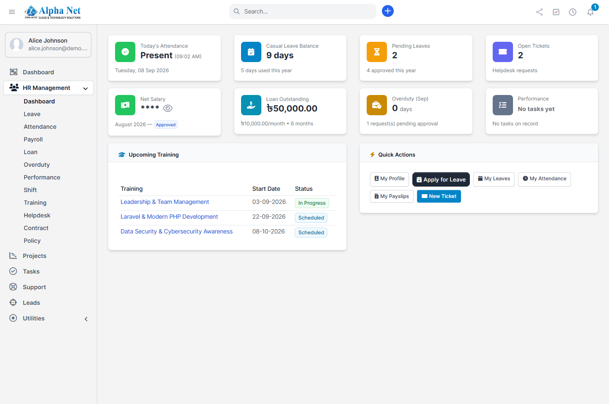

→ Full detail: [USER_GUIDE.md §1](USER_GUIDE.md#1-getting-started-the-hr-dashboard)

## Your Profile

**HR Management > Employees** (or straight from your Dashboard if you don't have directory access) — Work Info, Personal Info, and Bank Info tabs. Your name/email/phone always match your linked staff account.

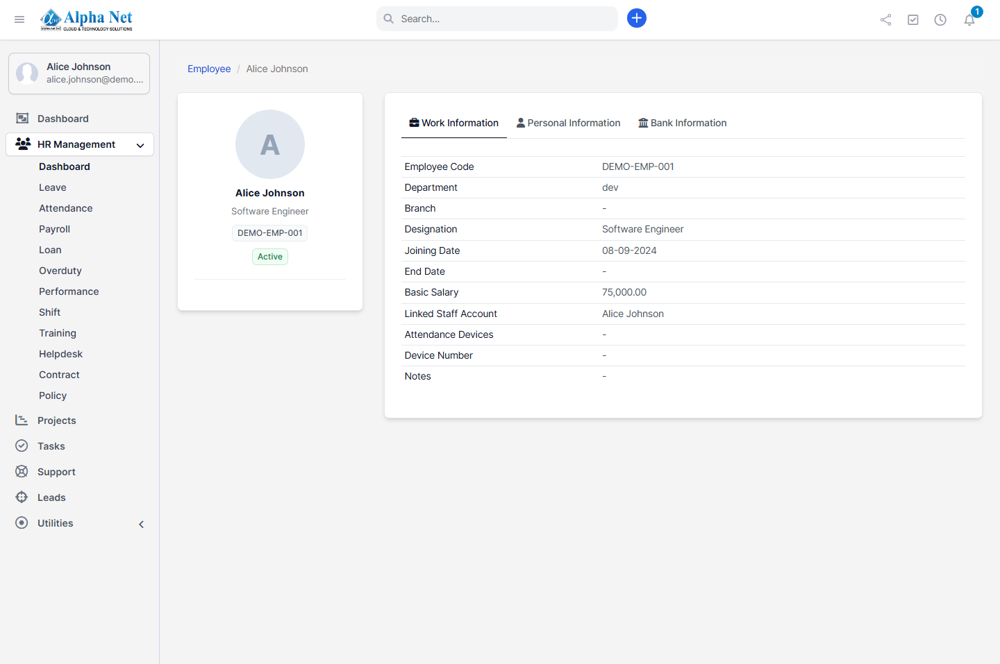

→ Full detail: [USER_GUIDE.md §2](USER_GUIDE.md#2-your-employee-profile)

## Leave

**Apply:** HR Management > Leave > **Apply for Leave** → pick leave type → add day(s) or a date range → watch your live balance and any weekend/holiday bridge warning → Submit.
**Cancel:** still pending → **Delete**. Already approved → **Request Cancellation** (HR reviews it).

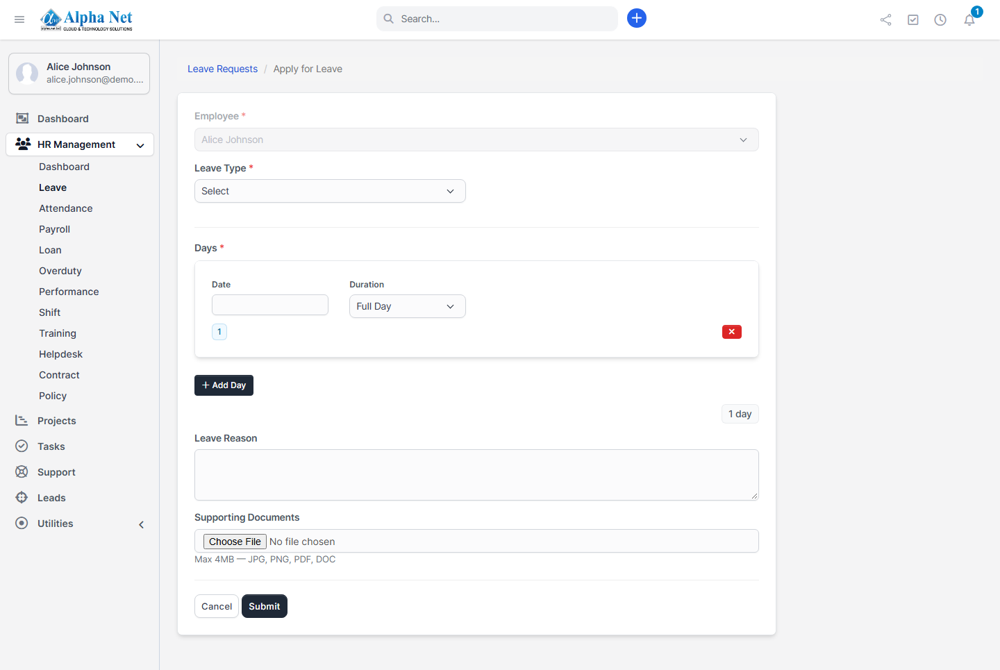

→ Full detail: [USER_GUIDE.md §3](USER_GUIDE.md#3-leave)

## Attendance

**HR Management > Attendance** — your monthly calendar, and **View Log** on any day for the individual punches behind it. Punches from a biometric device record automatically; no action needed from you.

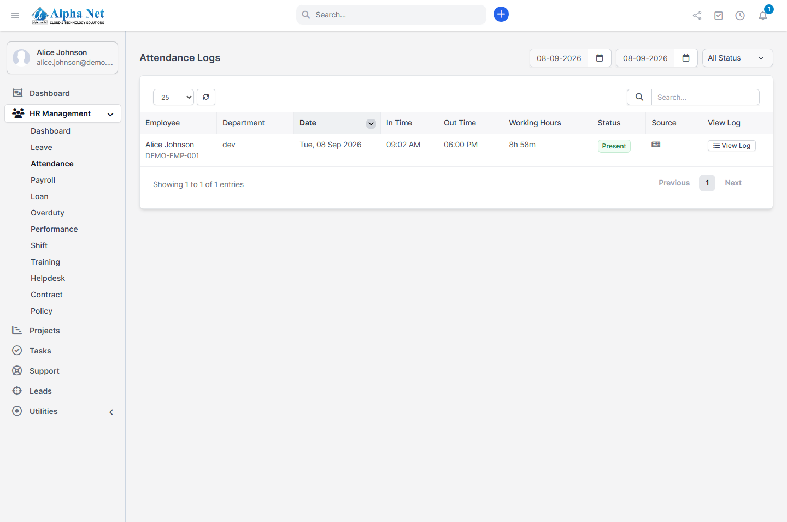

→ Full detail: [USER_GUIDE.md §4](USER_GUIDE.md#4-attendance)

## Loans

Your **maximum loan amount** is a total ceiling, not a per-request limit — see the worked example in the full guide. **Apply:** HR Management > Loans > **Apply for Loan** → see your live remaining-capacity hint → enter amount and installment → Submit. Need to skip or adjust a month's repayment? Use the deduction-request option on the loan's detail page.

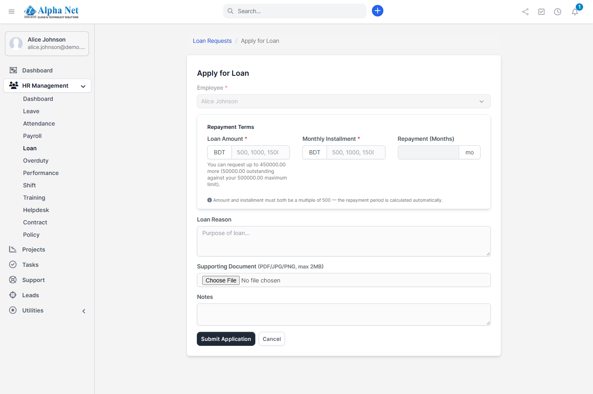

→ Full detail: [USER_GUIDE.md §5](USER_GUIDE.md#5-loans)

## Overtime

**HR Management > Overtime > Request Overtime** — dates must be within the **current calendar month**.

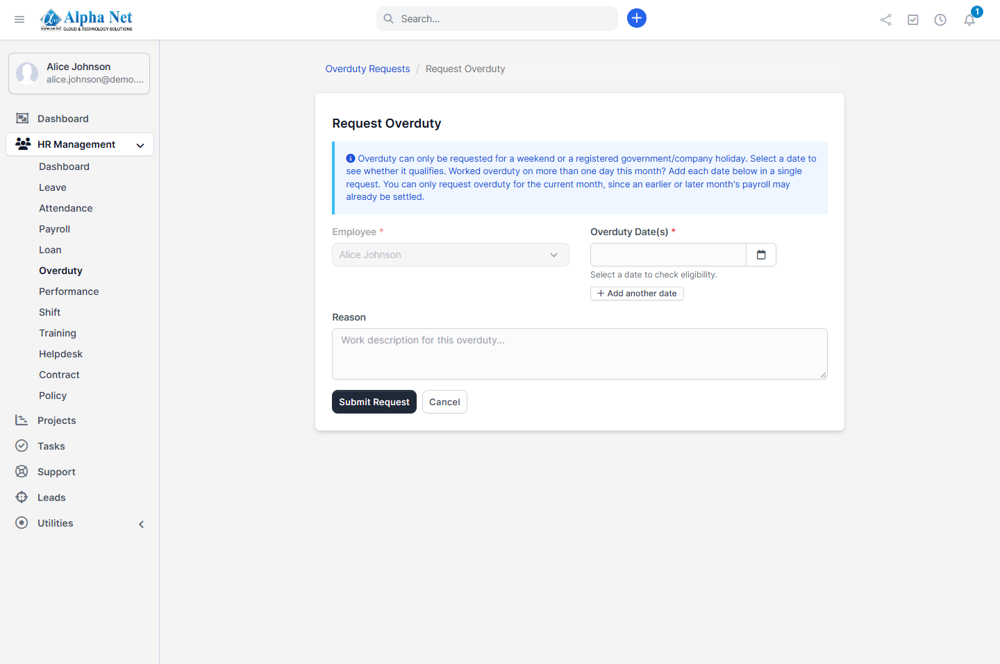

→ Full detail: [USER_GUIDE.md §6](USER_GUIDE.md#6-overtime)

## Shifts

**HR Management > Shifts > Request Shift** — add one or more dates, a shift type per date. Editable/deletable while still pending.

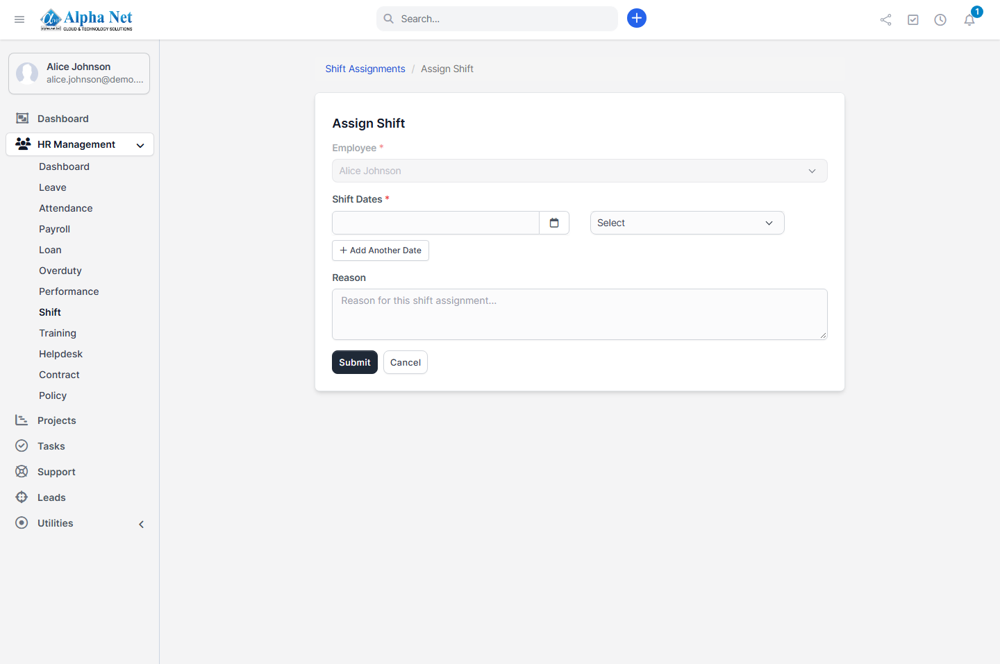

→ Full detail: [USER_GUIDE.md §7](USER_GUIDE.md#7-shifts)

## Payroll

**HR Management > Payroll** — your payslips, with a printable version.

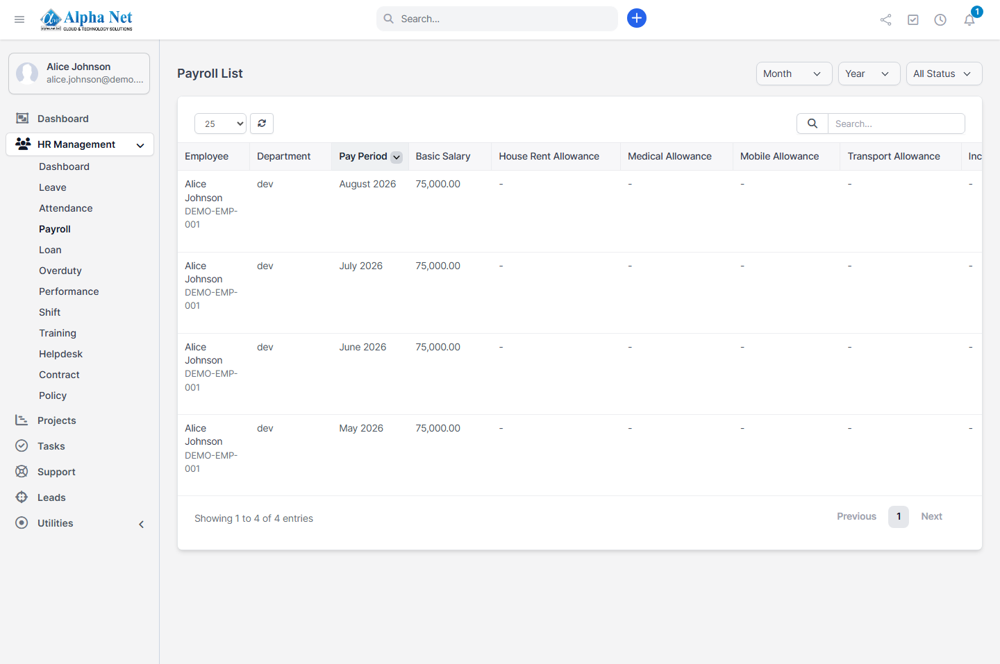

→ Full detail: [USER_GUIDE.md §8](USER_GUIDE.md#8-payroll)

## Performance

If you've been assigned a target, update your sub-targets' status and progress notes here. If you're an **evaluator** on someone else's sub-target, you can add feedback/rating on it too, even without company-wide access.

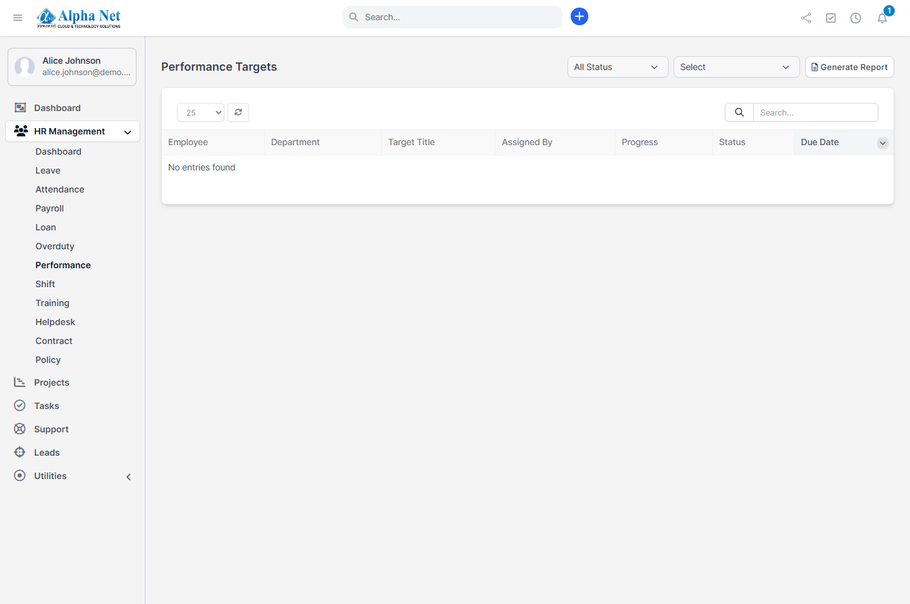

→ Full detail: [USER_GUIDE.md §9](USER_GUIDE.md#9-performance)

## Training

Upcoming/enrolled trainings show on your Dashboard. Leave feedback after attending.

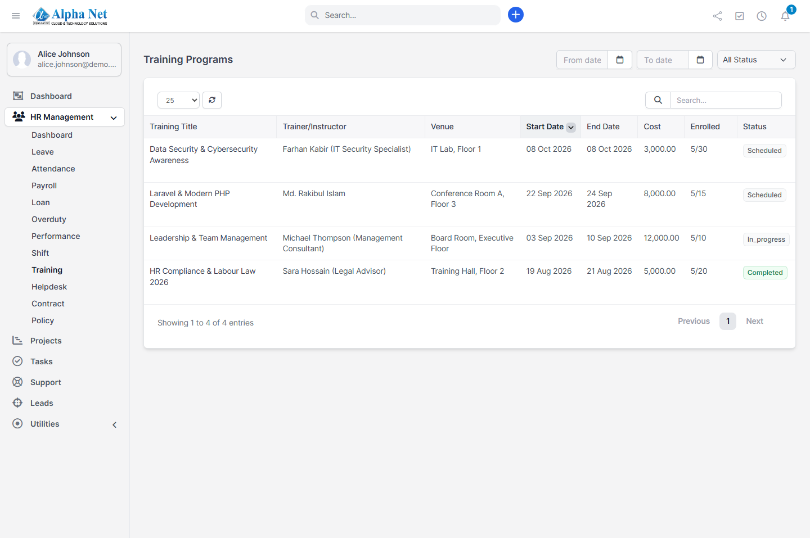

→ Full detail: [USER_GUIDE.md §10](USER_GUIDE.md#10-training)

## Helpdesk

**HR Management > Helpdesk > New Ticket** — optional category/priority/attachment, or check **Submit anonymously**.

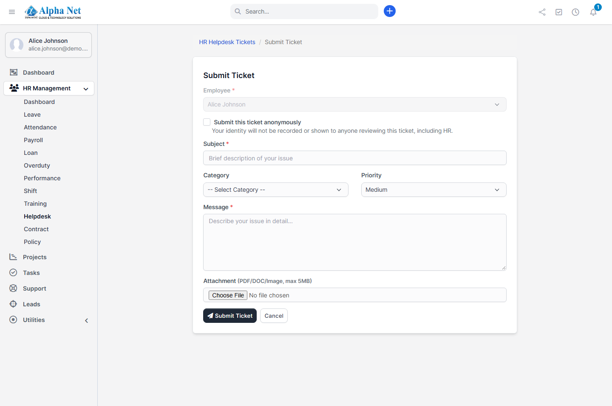

→ Full detail: [USER_GUIDE.md §11](USER_GUIDE.md#11-helpdesk)

## Contracts

**HR Management > HR Contracts** — your contract(s), with type/dates/value/signature status.

→ Full detail: [USER_GUIDE.md §12](USER_GUIDE.md#12-contracts)

## Policies

**HR Management > Policies** — public policies, plus any targeted at your department.

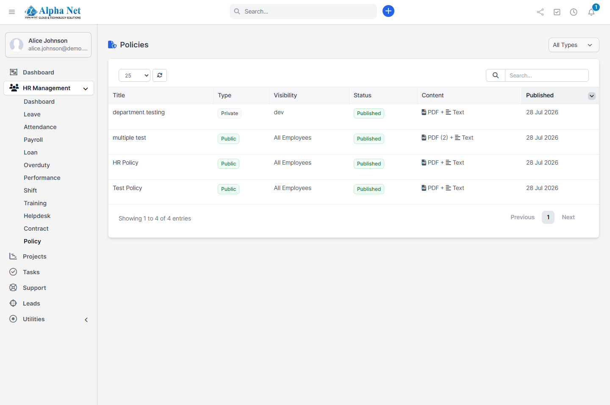

→ Full detail: [USER_GUIDE.md §13](USER_GUIDE.md#13-policies)

## Official Calendar

There's no separate calendar page for a plain employee to browse — instead, the company's holidays and weekly-off day(s) are checked **automatically** wherever they matter to you: the Leave Apply page's sandwich-rule warning (§3) and Overtime's eligibility check (§6) both already account for them live, as you fill in dates.

→ Full detail: [USER_GUIDE.md §14](USER_GUIDE.md#14-official-calendar)

---

## Frequently asked

See [USER_GUIDE.md §18](USER_GUIDE.md#18-frequently-asked-questions) — it covers the loan-capacity message, the gender-restricted leave types, the sandwich-rule warning, the Net Salary eye-toggle, and more, all from a plain-employee's point of view.
